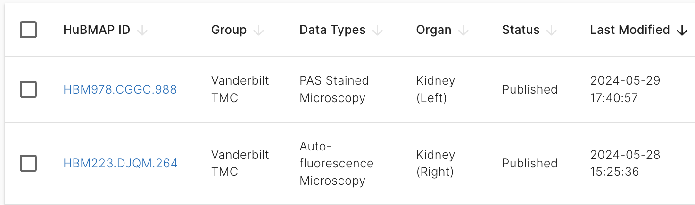

Hi! This is Christine. I am adding a sub branch to update what I have for the codes.

Currently, I finished writing some basic functions to extract information from HuBMAP portal. The codes are still under development, and some textual descriptions/functionality may not be complete.

In R, load the package which is cloning from this repository.

```{r}
devtools::load_all()
```

I am considering include five entity types:

-   dataset

-   sample

-   donor

-   collection

-   publication

All the information is extracted using `httr2` package, and please check `query.R` fo more details. There are different types of APIs, and the codes (so far) are based on [Search API](https://smart-api.info/ui/7aaf02b838022d564da776b03f357158#/search/search-post). Later, the [Entity API](https://smart-api.info/ui/0065e419668f3336a40d1f5ab89c6ba3#/) will be used to create Globus URL for user given uuid.

For every entity type, there will be one R script. The basic format is very similar in each entity R script. I will use `datasets.R` as example.

-   datasets()

    -   This function returns a tibble containing some basic information of all datasets (one row = one uuid = one dataset), including uuid, hubmap id, title, dataset type, and etc. The columns in the tibble is specifically seletced, which is not all the columns returned from API query (totally 35 columns; some column entries are list-of-lists). The columns match the information shown on portal page.

    

-   datasets_default_columns()

    -   This function displays the information shown from `datasets()` in character (default) or tibble.

```{r}
HuBMAPR::datasets_default_columns()
```

-   datasets_detail()

    -   This function returns all the information for one user given uuid.

```{r}
HuBMAPR::datasets_detail(uuid = "e0b9d2fe1ba6e32c7b7c2ff6a5d14202")
```

`samples.R`, `donors.R`, `collections.R`, and `publications.R` have these three basic functions to do similar work (returned default columns may be different). But `collections.R` and `publications.R` have additional functions to grab contributors, contacts, or related datasets. These are what I am exploring now, and are the details I will add later. What's more, `donors.R` is not uploaded (still work on it).

I am looking forward to user feedback. Any comment/criticism is very important for me to develop a better package. Please have a try on this "simple, not advanced" draft codes and give me any suggestion you have. Thanks for the time!
