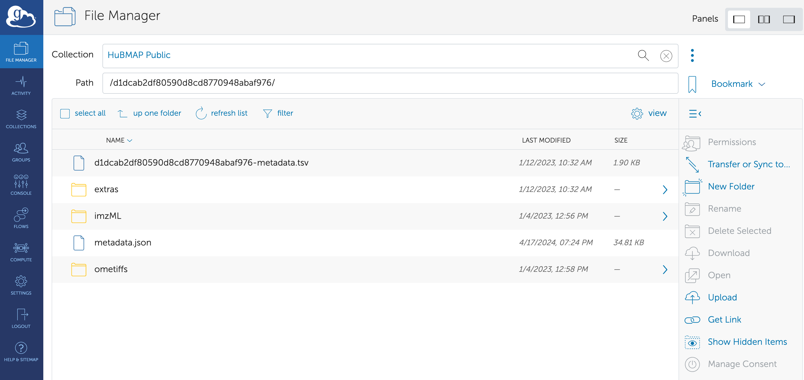
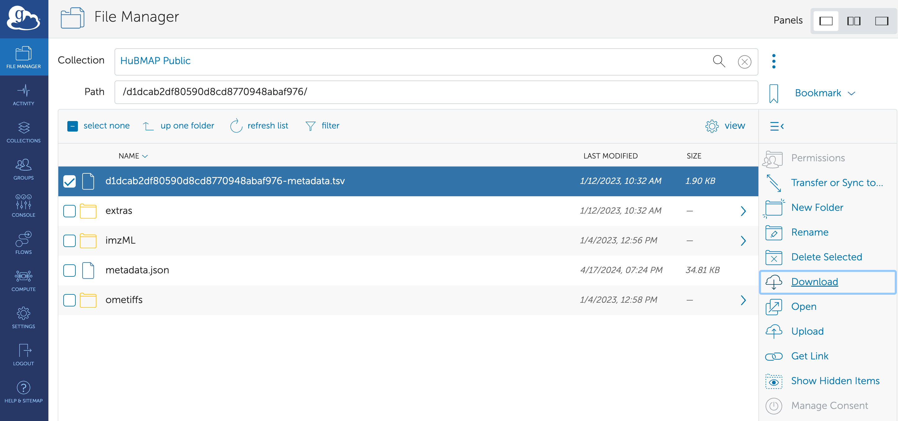

```{r, include = FALSE}
knitr::opts_chunk$set(
    collapse = TRUE,
    comment = "#>"
)
```

# Overview

'HuBMAP' data portal (<https://portal.hubmapconsortium.org/>) provides an open,
global bio-molecular atlas of the human body at the cellular level. `HuBMAPR`
package provides an alternative interface to explore the data via R.

The HuBMAP Consortium offers several
[APIs](https://docs.hubmapconsortium.org/apis.html). 
To achieve the main objectives, `HuBMAPR` package specifically integrates three
APIs:  

- [Search API](https://smart-api.info/ui/7aaf02b838022d564da776b03f357158): The
**Search API** is primarily searching relevant data information and is
referenced to the 
[Elasticsearch API](https://www.elastic.co/guide/en/elasticsearch/). 

- [Entity API](https://smart-api.info/ui/0065e419668f3336a40d1f5ab89c6ba3): The
**Entity API** is specifically utilized in the `bulk_data_transfer()`
function for Globus URL retrieval

- [Ontology API](https://smart-api.info/ui/d10ff85265d8b749fbe3ad7b51d0bf0a): 
The **Ontology API** is applied in the `organ()` function to provide additional
information about the abbreviation and corresponding full name of each organ.

Each API serves a distinct purpose with unique query capabilities, tailored to
meet various needs. Utilizing the `httr2` and `rjsoncons` packages, `HuBMAPR`
effectively manages, modifies, and executes multiple requests via these APIs,
presenting responses in formats such as tibble or character. These outputs are
further modified for clarity in the final results from the `HuBMAPR` functions,
and these functions help reflect the data information of HuBMAP Data Portal as 
much as possible.

Using temporary storage to cache API responses
facilitates efficient data retrieval by reducing the need for
redundant requests to the HuBMAP Data Portal. This
approach minimizes server load, improves response times (e.g.
`datasets()` takes less than 4 seconds to retrieve more than
3500 records’ information, shown below), 
and enhances overall query efficiency. By
periodically clearing cached data or directing them to a
temporary directory, the process ensures that the retrieved
information remains relevant while managing storage effectively.
This caching mechanism supports a smoother and more efficient
user experience when accessing data from the portal.

HuBMAP Data incorporates three different 
[identifiers](https://docs.hubmapconsortium.org/apis): 

- HuBMAP ID, e.g. HBM399.VCTL.353

- Universally Unique Identifier (UUID), e.g. 7036a70229eff1a51af965454dddbe7d

- Digital Object Identifiers (DOI), e.g. 10.35079/HBM399.VCTL.353.

The `HuBMAPR`
package utilizes the UUID - a 32-digit hexadecimal number - and the more
human-readable HuBMAP ID as two common identifiers in the retrieved results.
Considering precision and compatibility with software implementation and data
storage, UUID serves as the primary identifier to retrieve data across various
functions, with the UUID mapping uniquely to its corresponding HuBMAP ID. 

The
systematic nomenclature is adopted for functions in the package by appending
the entity category prefix to the concise description of the specific
functionality. Most of the functions are grouped by entity categories, thereby
simplifying the process of selecting the appropriate functions to retrieve the
desired information associated with the given UUID from the specific entity
category. The structure of these functions is heavily consistent across all
entity categories with some exceptions for collection and publication. 

# Installation

`HuBMAPR` is a R package. The package can be installed by

```{r 'install bioc', eval=FALSE}
if (!requireNamespace("BiocManager")) {
    install.packages("BiocManager")
}
BiocManager::install("HuBMAPR")
```

Install development version from
[GitHub](https://christinehou11.github.io/HuBMAPR):

```{r 'github', eval = FALSE}
remotes::install_github("christinehou11/HuBMAPR")
```

# Basic User Guide

## Implementation Notes

This session is to provide a guidance on extending or customizing the `HuBMAPR`
package to accommodate potential future changes in data structure, enhancing 
the package's long-term utility. We included a brief outline to illustrate the
basics of the principles and approach to package design.

- Identify an API end point

- Provide an R client to translate R data structures to the arguments and 
parameters required by the API
  
- Handle the response in a consistent way with respect to argument and response
validation

- Format the return value as a 'tibble' or 'character' to minimize cognitive 
demands on the user for interpreting the result, and to facilitate incorporation
into general R workflows

## Load Necessary Packages

Load additional packages. `dplyr` package is widely used in this vignettes to
conduct data wrangling and specific information extraction.

```{r 'library', message=FALSE, warning=FALSE}
library("dplyr")
library("tidyr")
library("ggplot2")
library("HuBMAPR")
library("pryr")
```

## Data Discovery

`HuBMAP` data portal page displays chronologically (last modified date time) 
five categories of entity data:

- **Dataset**

- **Sample** 

- **Donor** 

- **Publication**

- **Collection**. 

Using corresponding functions to explore entity data.

```{r 'datasets'}
system.time({
    datasets_df <- datasets()
})
object_size(datasets_df)

datasets_df
```

`samples()`, `donors()`, `collections()`, and `publications()` work same
as above.

```{r 'plot', echo=FALSE, warning=FALSE, message=FALSE}
datasets_sub <- datasets_df |>
    select(organ, dataset_type) |>
    group_by(organ) |>
    mutate(count = n()) |>
    filter(!is.na(organ))

colorblind_palette <- c(
    "10X Multiome" = "#E69F00",
    "2D Imaging Mass Cytometry" = "#56B4E9",
    "3D Imaging Mass Cytometry" = "#009E73",
    "ATACseq" = "#F0E442",
    "Auto-fluorescence" = "#8d46e3",
    "Cell DIVE" = "#D55E00",
    "CODEX" = "#ed027c",
    "DESI" = "#abf227",
    "Histology" = "#6e5740",
    "LC-MS" = "#05ddfa",
    "Light Sheet" = "#23e84a",
    "MALDI" = "#f54242",
    "MIBI" = "#022ded",
    "MUSIC" = "#4e6e4e",
    "Publication" = "#CC79A7",
    "RNAseq" = "#999999",
    "seqFish" = "#daf56c",
    "Slide-seq" = "#d427f2",
    "Visium (no probes)" = "#02eda3",
    "WGS" = "#0d0505")

plot1 <- ggplot(datasets_sub,
                aes(y = reorder(organ, count), fill = dataset_type)) + 
    geom_histogram(stat = "count") + 
    scale_fill_manual(values = colorblind_palette) +
    labs(x = NULL, y = NULL, fill = "Assay Type") + 
    theme_minimal() +
    theme(
        panel.grid.major.y = element_blank(),
        panel.grid.minor = element_blank(),
        axis.text.y = element_text(size = 9),
        axis.text.x = element_text(size = 9),
        legend.position = "bottom",
        legend.title = element_text(size = 9),
        legend.text = element_text(size = 7), 
        panel.background = element_rect(fill = "white", color = NA),
        plot.background = element_rect(fill = "white", color = NA)) +
    guides(fill = guide_legend(nrow = 4))

plot1
```

The default tibble produced by corresponding entity function only reflects
selected information. To see the names of selected information, use following
commands for each entity category. Specify `as` parameter to display
information in the format of `"character"` or `"tibble"`.


```{r 'cols'}
# as = "tibble" (default)
datasets_col_tbl <- datasets_default_columns(as = "tibble")
datasets_col_tbl

# as = "character"
datasets_col_char <- datasets_default_columns(as = "character")
datasets_col_char
```

`samples_default_columns()`, `donors_default_columns()`,
`collections_default_columns()`, and `publications_default_columns()` work same
as above.

A brief overview of selected information for five entity categories is:

```{r 'summary cols'}
tbl <- bind_cols(
    dataset = datasets_default_columns(as = "character"),
    sample = c(samples_default_columns(as = "character"), rep(NA, 7)),
    donor = c(donors_default_columns(as = "character"), rep(NA, 6)),
    collection = c(collections_default_columns(as = "character"),
                    rep(NA, 10)),
    publication = c(publications_default_columns(as = "character"),
                    rep(NA, 7))
)

tbl
```

Use `organ()` to read through the available organs included in `HuBMAP`. It can
be helpful to filter retrieved data based on organ information.

```{r 'organs'}
organs <- organ()
organs
```

### Data Wrangling Examples

Data wrangling and filter are welcome to retrieve data based on interested
information.

```{r 'datasets filter'}
# Example from datasets()
datasets_df |>
    filter(organ == 'Small Intestine') |>
    count()
```

Any dataset, sample, donor, collection, and publication has special 
**HuBMAP ID** and **UUID**, and **UUID** is the main ID to be used in most of
functions for specific detail retrievals.

The column of **donor_hubmap_id** is included in the retrieved tibbles from
`samples()` and `datasets()`, which can help to join the tibble.

```{r 'derived using left_join'}
donors_df <- donors()
donor_sub <- donors_df |>
    filter(Sex == "Female",
            Age <= 76 & Age >= 55,
            Race == "White",
            `Body Mass Index` <= 25,
            last_modified_timestamp >= "2020-01-08" &
            last_modified_timestamp <= "2020-06-30") |>
    head(1)

# Datasets
donor_sub_dataset <- donor_sub |>
    left_join(datasets_df |>
                select(-c(group_name, last_modified_timestamp)) |>
                rename("dataset_uuid" = "uuid",
                        "dataset_hubmap_id" = "hubmap_id"),
                by = c("hubmap_id" = "donor_hubmap_id"))

donor_sub_dataset

# Samples
samples_df <- samples()
donor_sub_sample <- donor_sub |>
    left_join(samples_df |>
                select(-c(group_name, last_modified_timestamp)) |>
                rename("sample_uuid" = "uuid",
                        "sample_hubmap_id" = "hubmap_id"),
                by = c("hubmap_id" = "donor_hubmap_id"))

donor_sub_sample
```

You can use `*_detail(uuid)` to retrieve all available information for any
entry of any entity category given **UUID**. Use `select()` and `unnest_*()`
functions to expand list-columns. It will be convenient to view tables with
multiple columns but one row using `glimpse()`.

```{r '*_detail()'}
dataset_uuid <- datasets_df |>
    filter(dataset_type == "Auto-fluorescence",
            organ == "Kidney (Right)") |>
    head(1) |>
    pull(uuid)

# Full Information
dataset_detail(dataset_uuid) |> glimpse()

# Specific Information
dataset_detail(uuid = dataset_uuid) |>
    select(contributors) |>
    unnest_longer(contributors) |>
    unnest_wider(everything())
```

`sample_detail()`, `donor_detail()`, `collection_detail()`, and
`publication_detail()` work same as above.

## Metadata

To retrieve the metadata for **Dataset**, **Sample**, and **Donor** metadata,
use `dataset_metadata()`, `sample_metadata()`, and `donor_metadata()`.

```{r 'metadata'}
dataset_metadata("993bb1d6fa02e2755fd69613bb9d6e08")

sample_metadata("8ecdbdc3e2d04898e2563d666658b6a9")

donor_metadata("b2c75c96558c18c9e13ba31629f541b6")
```

## Derived Data

Some datasets from **Dataset** entity has derived (support) dataset(s). Use
`dataset_derived()` to retrieve. A tibble with selected details will be
retrieved as if the given dataset has support dataset; otherwise, nothing
returns.

```{r 'dataset derived'}
# no derived/support dataset
dataset_uuid_1 <- "3acdb3ed962b2087fbe325514b098101"

dataset_derived(uuid = dataset_uuid_1)

# has derived/support dataset
dataset_uuid_2 <- "baf976734dd652208d13134bc5c4594b"

dataset_derived(uuid = dataset_uuid_2) |> glimpse()
```

**Sample** and **Donor** have derived samples and datasets. In `HuBAMPR`
package, `sample_derived()` and `donor_derived()` functions are available to
use to see the derived datasets and samples from one sample given sample UUID
or one donor given donor UUID. Specify `entity_type` parameter to retrieve
derived `Dataset` or `Sample`.

```{r 'derived using sample_derived'}
sample_uuid <- samples_df |>
    filter(last_modified_timestamp >= "2023-01-01" &
            last_modified_timestamp <= "2023-10-01",
            organ == "Kidney (Left)") |>
    head(1) |>
    pull(uuid)

sample_uuid

# Derived Datasets
sample_derived(uuid = sample_uuid, entity_type = "Dataset")

# Derived Samples
sample_derived(uuid = sample_uuid, entity_type = "Sample")
```

`donor_derived()` works same as above.

## Provenance Data

For individual entries from **Dataset** and **Sample** entities,
`uuid_provenance()` helps to retrieve the provenance of the entry as a list of
characters (UUID, HuBMAP ID, and entity type) from the most recent ancestor to
the furthest ancestor. There is no ancestor for Donor UUID, and an empty list
will be returned.

```{r 'provenance'}
# dataset provenance
dataset_uuid <- "3e4c568d9ce8df9d73b8cddcf8d0fec3"
uuid_provenance(dataset_uuid)

# sample provenance
sample_uuid <- "35e16f13caab262f446836f63cf4ad42"
uuid_provenance(sample_uuid)

# donor provenance
donor_uuid <- "0abacde2443881351ff6e9930a706c83"
uuid_provenance(donor_uuid)
```

## Related Data

Each **Collection** has related datasets, and use `collection_data()` to
retrieve.

```{r 'collection datasets'}
collections_df <- collections()
collection_uuid <- collections_df |>
    filter(last_modified_timestamp >= "2023-01-01") |>
    head(1) |>
    pull(uuid)

collection_data(collection_uuid)
```

Each publication has related datasets, samples, and donors, and use
`publication_data()` to see, while specifying `entity_type` parameter to
retrieve derived `Dataset` or `Sample`.

```{r 'publication data'}
publications_df <- publications()
publication_uuid <- publications_df |>
    filter(publication_venue == "Nature") |>
    head(1) |>
    pull(uuid)

publication_data(publication_uuid, entity_type = "Dataset")

publication_data(publication_uuid, entity_type = "Sample")
```

## Additional Information

To read the textual description of one **Collection** or **Publication**, use
`collection_information()` or `publication_information()` respectively.

```{r 'information'}
collection_information(uuid = collection_uuid)

publication_information(uuid = publication_uuid)
```

Some additional contact/author/contributor information can be retrieved using
`dataset_contributor()` for **Dataset** entity, `collection_contact()` and
`collection_contributors()` for **Collection** entity, or
`publication_authors()` for **Publication** entity.

```{r 'author'}
# Dataset
dataset_contributors(uuid = dataset_uuid)

# Collection
collection_contacts(uuid = collection_uuid)

collection_contributors(uuid = collection_uuid)

# Publication
publication_authors(uuid = publication_uuid)
```

# File Transfer

For each dataset, there are corresponding data files. Most of the datasets'
files are available on HuBMAP Globus with corresponding URL. Some of the
datasets' files are not available via Globus, but can be accessed via dbGAP
(database of Genotypes and Phenotypes) and/or SRA (Sequence Read Archive). But
some of the datasets' files are not available in any authorized platform.

Each dataset available on Globus has different components of data-related files
to preview and download, include but not limited to images, metadata files,
downstream analysis reports, raw data products, etc. 

Use `bulk_data_transfer()` to know whether data files are open-accessed or
restricted. Only open-accessed files can be downloaded for downstream analysis.

#### Files are publicly accessible

HuBMAP stored all public data files on Globus, which is a open-source and safe
platform for the large-size data storage. For every dataset which the data
files can be publicly accessed, the `bulk_data_transfer()` function will direct
to corresponding Globus webpage in Chrome. 

```{r 'bulk data transfer successful', eval=FALSE}
uuid_globus <- "d1dcab2df80590d8cd8770948abaf976"

bulk_data_transfer(uuid_globus)
```

<figure>

</figure>

By selecting the data file and clicking on "Download" button, the data file can
be downloaded to the specific directory.

<figure>

</figure>

##### Alternative data transfer method using rglobus package

Martin Morgan, one of the `HuBMAPR` package creators, generated an 
experimental package called
[rglobus](https://github.com/mtmorgan/rglobus/). 

Globus is in part a cloud-based file transfer service, available at
https://www.globus.org/. This package provides an *R* client with the ability
to discover and navigate collections, and to transfer files and directories
between collections. Therefore, `rglobus` is an alternative method to transfer
HuBMAP data files on the local computer using HuBMAP dataset UUID.

`rglobus` has the vignette documentation 
[here](https://mtmorgan.github.io/rglobus/articles/a_get_started.html) using
HuBMAP collection as the main example to illustrate how to discover and 
navigate the correct collection, and transfer the files. 

Since `rglobus` is an experimental package, the functionality may not
be complete. It is possible to see transfer issues while using functions. There
will be more information updated in the future. You are welcome to report any
issue or provide any comment [here](https://github.com/mtmorgan/rglobus/issues)
to help us develop.

#### Files are restricted

For every dataset which the data files are restricted under dbGAP or SRA, the
`bulk_data_transfer()` function will print out the instruction messages. The
dbGaP or/and SRA link(s) allow the users to request the protected-access
sequence data from authenticated platform.

```{r 'bulk data transfer urls', eval=FALSE}
uuid_dbGAP_SRA <- "d926c41ac08f3c2ba5e61eec83e90b0c"

bulk_data_transfer(uuid_dbGAP_SRA)
```

```{r,comment=NA, echo=FALSE}
result1 <- paste("Pruning cache",
    "Error in bulk_data_transfer(uuid_dbGAP_SRA) :",
    "This dataset contains protected-access human sequence data.",
    "If you are not a Consortium member,",
    "you must access these data through dbGaP if available.",
    "dbGaP authentication is required for downloading.",
    "View documentation on how to attain dbGaP access.",
    "Additional Help: 'https://hubmapconsortium.org/contact-form/'",
    "Navigate to the 'Bioproject' or 'Sequencing Read Archive' links.",
    "dbGaP URL: 
https://www.ncbi.nlm.nih.gov/projects/gap/cgi-bin/study.cgi?study_id=phs002267",
    "Select the 'Run' link on the page to download the dataset.",
    "Additional documentation: https://www.ncbi.nlm.nih.gov/sra/docs/.",
    "SRA URL: https://www.ncbi.nlm.nih.gov/sra/SRX13283313.)",
    sep = "\n")

cat(result1)
```

#### Files are unavailable

For every dataset which the data files not available, the 
`bulk_data_transfer()` function will print out the messages. 

```{r 'bulk data transfer not avail', eval=FALSE}
uuid_not_avail <- "0eb5e457b4855ce28531bc97147196b6"

bulk_data_transfer(uuid_not_avail)
```

```{r,comment=NA, echo=FALSE}
result2 <- paste("Pruning cache",
    "Error in bulk_data_transfer(uuid_not_avail) :",
    "This dataset contains protected-access human sequence data.",
    "Data isn't yet available through dbGaP,",
    "but will be available soon.",
    "Please contact us via 'https://hubmapconsortium.org/contact-form/'",
    "with any questions regarding this data.",
    sep = "\n")

cat(result2)
```


# `R` session information {.unnumbered}

```{r 'sessionInfo', echo=FALSE}
## Session info
options(width = 120)
sessionInfo()
```
